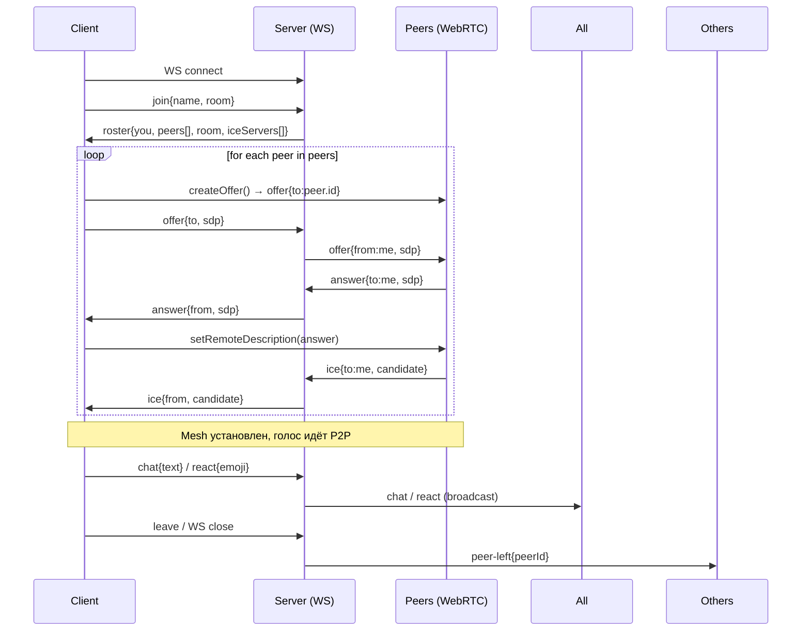

# VOICE ROOM — Архитектура бэкенда / фронтенда (спецификация интеграции)

> Этот документ описывает, как текущий React-фронтенд (мок-версия) должен подключаться к реальному бэкенду. Все места, где сейчас используются мок-данные, помечены в коде комментариями `NOTE(preview):`.

---

## 1. Обзор стека

| Слой | Технология | Примечание |
|------|------------|------------|
| Frontend | React 18 + Vite, vanilla CSS, ES модули | ~20 KB gzipped JS, без фреймворков UI |
| Signaling / Chat / Reactions | WebSocket (ws) поверх того же origin | Одно соединение на комнату |
| Voice (WebRTC) | Mesh (peer-to-peer), STUN по умолчанию, TURN через ENV | Deterministic offers: существующие пиры делают offer к новому |
| Статика | Express (Node) раздаёт `dist/` | Single-page, history API fallback не нужен (hash-based routing) |
| Хранение | In-memory (Map<roomId, RoomState>) | Нет БД, нет аккаунтов, нет персистентности |

---

## 2. Протокол WebSocket (JSON)

Все сообщения — объекты с полем `t` (type). Клиент и сервер говорят на одном языке.

### 2.1 Клиент → Сервер

| Тип (`t`) | Пейлоад | Описание |
|-----------|---------|----------|
| `join` | `{ name: string, room: string }` | Вход в комнату. `name` может быть пустым → сервер генерирует `Гость-XXXX`. |
| `offer` | `{ to: string, sdp: RTCSessionDescriptionInit }` | WebRTC offer к пиру `to` (peerId). |
| `answer` | `{ to: string, sdp: RTCSessionDescriptionInit }` | WebRTC answer. |
| `ice` | `{ to: string, candidate: RTCIceCandidateInit }` | ICE candidate. |
| `chat` | `{ text: string }` | Текстовое сообщение в общий чат комнаты. |
| `react` | `{ emoji: string }` | Реакция (один эмодзи). Сервер **enforced** лимит 1/10с на пользователя. |
| `leave` | `{}` | Явный выход (опционально, есть WS close). |
| `ping` | `{}` | Heartbeat (каждые 25с). Сервер отвечает `pong`. |

### 2.2 Сервер → Клиент

| Тип (`t`) | Пейлоад | Описание |
|-----------|---------|----------|
| `roster` | `{ you: Peer, peers: Peer[], room: string }` | Сразу после `join`. `you` — текущий пользователь, `peers` — остальные. |
| `peer-joined` | `{ peer: Peer }` | Новый участник вошёл. Существующие пиры должны сделать `offer` к нему. |
| `peer-left` | `{ peerId: string }` | Участник ушёл. Удаляем peer connection. |
| `offer` / `answer` / `ice` | `{ from: string, ... }` | WebRTC сигналинг — просто ретранслируем. |
| `chat` | `{ from: string, fromName: string, text: string, ts: number, me?: boolean }` | Новое сообщение. `me: true` если это моё (эхо). |
| `react` | `{ from: string, fromName: string, emoji: string, ts: number }` | Реакция кого-то. Клиент рендерит float/big/feed. |
| `speaking` | `{ peerId: string, speaking: boolean }` | Уровень голосовой активности (Voice Activity Detection на сервере или клиенте — см. §4). |
| `latency` | `{ peerId: string, rtt: number }` | Измеренная RTT (опционально, для строки «ЗАДЕРЖКА 42МС · OPUS»). |
| `pong` | `{}` | Ответ на ping. |
| `error` | `{ code: string, message: string }` | Ошибки: `NAME_TAKEN`, `ROOM_FULL`, `RATE_LIMIT`, etc. |

---

## 3. Структуры данных

```ts
// Peer — один участник в ростере
interface Peer {
  id: string;              // уникальный в комнате (сокет id или UUID)
  name: string;            // отображаемое имя (как ввели или «Гость-XXXX»)
  guest: boolean;          // true если безымянный гость
  muted: boolean;          // микрофон выключен (track.enabled = false)
  speaking?: boolean;      // сейчас говорит (VAD)
}

// Roster — приходит в ответе на join
interface RosterMessage {
  t: 'roster';
  you: Peer;
  peers: Peer[];
  room: string;            // нормализованный код комнаты (uppercase)
}
```

---

## 4. WebRTC Mesh — детали

1. **Deterministic offers**: когда новый пир присоединяется, сервер шлёт `peer-joined` всем старым. **Только старые пиры** создают `offer` → новый получает N офферов, отвечает `answer` каждому. Это исключает glare.
2. **ICE**: по умолчанию `stun:stun.l.google.com:19302`. TURN URL/credential берутся из ENV (`TURN_URL`, `TURN_USER`, `TURN_PASS`) и передаются клиенту в `roster.iceServers` (массив `RTCIceServer`).
3. **Мут**: `track.enabled = false` — **без renegotiation**. Сервер не участвует.
4. **Speaking detection**: в мок-версии фронтенд сам эмулирует (`setInterval` ротация). В продакшене:
   - Вариант А (клиентский VAD): каждый пир локально запускает `AudioContext + AnalyserNode` на своём исходящем треке, шлёт `speaking` события по WS (троттлинг ~200мс).
   - Вариант Б (серверный VAD): сервер получает аудио через SFU/бот — сложнее, не для MVP.
   Рекомендую **А** — дешево, работает в mesh.

---

## 5. Что сейчас мокнуто во фронтенде (файлы → что заменить)

| Файл / хук | Что мокнуто | Что должен дать бэкенд |
|------------|-------------|------------------------|
| `src/hooks.js` → `useRoomCode` | Комната из `location.hash` | Тот же hash → `room` в `join` |
| `src/mock.js` → `MOCK_ROSTER` | 11 фиктивных участников | `roster.peers` от сервера |
| `src/mock.js` → `SPEAK_ORDER` | Ротация говорящих каждые 2.2с | `speaking` события по WS (VAD) |
| `src/mock.js` → `latencyMs()` | Случайная задержка 28–68мс | `latency` события (RTT из пинга или WebRTC stats) |
| `src/App.jsx` → `sendChat` | Локальный пуш + таймаут «хаха +1» | `chat` broadcast от сервера (все получают, отправитель — с `me: true`) |
| `src/App.jsx` → `sendReact` | Локальный кулдаун, float/big/feed | `react` broadcast от сервера (сервер проверяет 10с лимит, отбрасывает лишние) |
| `src/App.jsx` → `applyJoin` | localStorage + toast | `join` → сервер отвечает `roster` (или `error`) |
| `src/App.jsx` → `leave` | Просто переключение view | `leave` + WS close → сервер шлёт `peer-left` остальным |

**Все места в коде с `NOTE(preview):` — точки интеграции.**

---

## 6. Последовательность подключения (sequence)



---

## 7. Серверная реализация — минимальный чек-лист

### 7.1 Состояние в памяти

```js
// Map<roomId, Room>
const rooms = new Map();

class Room {
  constructor(id) {
    this.id = id;
    this.peers = new Map(); // peerId -> { ws, peerData, pcMap }
    this.reactCooldown = new Map(); // peerId -> lastReactTs
  }
}
```

### 7.2 Обработка `join`

```js
function handleJoin(ws, { name, room }) {
  const roomId = room.toUpperCase().slice(0, 12);
  let room = rooms.get(roomId);
  if (!room) room = rooms.set(roomId, new Room(roomId)).get(roomId);

  if (room.peers.size >= 10) return ws.send(JSON.stringify({ t: 'error', code: 'ROOM_FULL' }));

  const peerId = crypto.randomUUID();
  const isGuest = !name?.trim();
  const displayName = isGuest ? `Гость-${1000 + Math.random()*9000|0}` : name.trim().slice(0, 20);

  const peer = { id: peerId, name: displayName, guest: isGuest, muted: false, ws };

  // 1. Сообщаем новому — кто уже в комнате
  const peersArray = [...room.peers.values()].map(p => ({ id: p.id, name: p.name, guest: p.guest, muted: p.muted }));
  ws.send(JSON.stringify({ t: 'roster', you: { ...peer, you: true }, peers: peersArray, room: roomId, iceServers: getIceServers() }));

  // 2. Рассылаем остальным — что присоединился новый
  room.peers.forEach(p => p.ws.send(JSON.stringify({ t: 'peer-joined', peer: { id: peerId, name: displayName, guest: isGuest, muted: false } })));

  room.peers.set(peerId, peer);
}
```

### 7.3 Ретрансляция сигналинга (offer/answer/ice)

```js
function relay(ws, msg) {
  const target = rooms.get(currentRoom)?.peers.get(msg.to);
  if (target) target.ws.send(JSON.stringify({ ...msg, from: ws.peerId }));
}
```

### 7.4 Чат и реакции (broadcast с лимитами)

```js
function broadcast(roomId, msg, exclude = null) {
  rooms.get(roomId)?.peers.forEach(p => {
    if (p.id !== exclude) p.ws.send(JSON.stringify(msg));
  });
}

function handleChat(ws, { text }) {
  const msg = { t: 'chat', from: ws.peerId, fromName: ws.peer.name, text: escapeHtml(text), ts: Date.now() };
  broadcast(ws.room, msg, ws.peerId); // остальным
  ws.send(JSON.stringify({ ...msg, me: true })); // эхо отправителю
}

function handleReact(ws, { emoji }) {
  const now = Date.now();
  const last = ws.roomObj.reactCooldown.get(ws.peerId) || 0;
  if (now - last < 10_000) return; // тихо дропаем или шлём error
  ws.roomObj.reactCooldown.set(ws.peerId, now);
  broadcast(ws.room, { t: 'react', from: ws.peerId, fromName: ws.peer.name, emoji, ts: now });
}
```

### 7.5 Heartbeat / Graceful leave

```js
ws.on('close', () => {
  const room = rooms.get(ws.room);
  if (!room) return;
  room.peers.delete(ws.peerId);
  broadcast(ws.room, { t: 'peer-left', peerId: ws.peerId });
  if (room.peers.size === 0) setTimeout(() => rooms.delete(ws.room), 10_000); // 10с grace
});
```

---

## 8. Переменные окружения (`.env` на сервере)

```dotenv
PORT=3000
# TURN (опционально, для NAT traversal)
TURN_URL=turn:turn.example.com:3478?transport=udp
TURN_USER=username
TURN_PASS=secret
# STUN по умолчанию stun:stun.l.google.com:19302 — можно переопределить
STUN_URL=stun:stun.example.com:3478
```

Фронтенд получает `iceServers` в `roster` и передаёт в `new RTCPeerConnection({ iceServers })`.

---

## 9. Фронтенд — точки подключения (где менять код)

### 9.1 `src/hooks.js` — добавить `useSocket(room, onMessage)`

```js
export function useSocket(room, handlers) {
  const wsRef = useRef(null);
  useEffect(() => {
    const ws = new WebSocket(`${location.protocol.replace('http','ws')}//${location.host}/ws`);
    wsRef.current = ws;
    ws.onopen = () => ws.send(JSON.stringify({ t: 'join', name: myName, room }));
    ws.onmessage = e => {
      const msg = JSON.parse(e.data);
      handlers[msg.t]?.(msg);
    };
    return () => ws.close();
  }, [room]);
  const send = (msg) => wsRef.current?.readyState === 1 && wsRef.current.send(JSON.stringify(msg));
  return { send };
}
```

### 9.2 `src/App.jsx` — заменить мок-логику на WS-хендлеры

```js
const { send } = useSocket(roomLower, {
  roster: (msg) => { setMe(msg.you); setMembers([msg.you, ...msg.peers]); setIceServers(msg.iceServers); },
  'peer-joined': (msg) => { setMembers(m => [...m, msg.peer]); createOfferTo(msg.peer.id); },
  'peer-left': (msg) => { setMembers(m => m.filter(p => p.id !== msg.peerId)); closePc(msg.peerId); },
  offer: handleOffer,
  answer: handleAnswer,
  ice: handleIce,
  chat: (msg) => pushMsg(msg.fromName, msg.text, msg.me),
  react: (msg) => receiveReact(msg.from, msg.emoji),
  speaking: (msg) => setSpeaking(s => msg.speaking ? [...s, msg.peerId] : s.filter(id => id !== msg.peerId)),
  latency: (msg) => setLatency(msg.rtt),
  error: (msg) => showToast(msg.message),
});
```

### 9.3 WebRTC-хелперы (можно вынести в `src/webrtc.js`)

- `createPeerConnection(peerId, iceServers)` — создаёт `RTCPeerConnection`, вешает `ontrack` (добавляет `MediaStream` в стейт для `<audio>`), `onicecandidate` → `send({t:'ice', to:peerId, candidate})`.
- `makeOffer(to)` → `pc.createOffer()` → `setLocalDescription` → `send({t:'offer', to, sdp})`.
- `handleOffer(msg)` → `setRemoteDescription` → `createAnswer` → `send({t:'answer', to:msg.from, sdp})`.

---

## 10. Безопасность и лимиты (Must Have)

| Вектор | Мера |
|--------|------|
| Спам реакциями | Серверный кулдаун 10с/юзер (в памяти на комнату) |
| Спам чатом | Троттлинг 1 сообщ/сек, макс длина 500 символов, санитизация HTML |
| Перебор комнат | Rate-limit на `join` по IP (например, 5/мин) |
| Перегрузка mesh | Хард-лимит 10 пиров в комнате (WebRTC mesh O(n²) connections) |
| TURN abuse | Короткие TTL credentials, rotation, только для своих комнат |
| Fingerprinting | Не логировать имена гостей в продакшн-логах |

---

## 11. Масштабирование (когда 1 сервер не хватит)

1. **Sticky sessions** — WebSocket требует affinity. Балансер (nginx/haproxy) с `ip_hash` или cookie.
2. **Pub/Sub между инстансами** — Redis PubSub: `chat`, `react`, `peer-joined/left` бродкастятся в канал `room:{id}`. Каждый инстанс подписан и доставляет своим WS-клиентам.
3. **WebRTC не через сервер** — mesh остаётся P2P, сигналинг через WS. Нагрузка на WS-сервер мала (сигналинг ~ KB/s на пира).
4. **SFU для >10** — если нужно больше участников, заменить mesh на SFU (mediasoup, livekit, janus). Это отдельная архитектура.

---

## 12. Тестирование интеграции (чек-лист QA)

| Сценарий | Ожидаемое поведение |
|----------|---------------------|
| Вход с именем | `roster.you.name === name`, `guest: false`, имя в localStorage |
| Вход без имени | `roster.you.name === 'Гость-XXXX'`, `guest: true`, НЕ в localStorage |
| Второй вкладка та же комната | Новый `peerId`, `peer-joined` у первого, mesh устанавливается |
| Мут/анмут | `track.enabled` toggles, **нет** renegotiation, иконка меняется |
| Чат | Сообщение приходит всем, у отправителя `me: true`, unread badge у закрытого чата |
| Реакция | Float/big/feed у всех, сервер блокирует 2-ю за 10с → клиент показывает shake+toast |
| Выход через кнопку | `leave` → сервер `peer-left` остальным, локальный `view='join'` |
| Закрыть вкладку | WS close → сервер `peer-left` через 0мс (или 10с grace) |
| Перезаход (reconnect) | Новый WS → `join` → новый `peerId` → mesh перестраивается |
| `prefers-reduced-motion` | Никаких CSS-анимаций, canvas циклы останавливаются, контент виден |
| Мобильный Safari | `navigator.share()` работает, иначе clipboard + toast |

---

## 13. Файловая карта фронтенда (для бэкендера)

```
src/
├── config.js           # ENV-константы (roomDefault, emojiCooldownMs, …)
├── content.js          # Все строки RU + EMOJIS массив
├── mock.js             # МОК-ДАННЫЕ (roster, speak order, latency) — УДАЛИТЬ ПРИ ПОДКЛЮЧЕНИИ БЭКА
├── hooks.js            # useRoomCode, useToast, vibrate
├── App.jsx             # ГЛАВНОЕ СОСТОЯНИЕ + интеграция WS (заменить моки на хендлеры)
├── components/
│   ├── Chrome.jsx      # Toast, TopBar (share button)
│   ├── JoinView.jsx    # Экран входа + ambient canvas
│   ├── RoomView.jsx    # Комната: топ-4 плитки + overflow-список + wave canvas
│   ├── Overlays.jsx    # Controls, ChatSheet, EmojiPop, FxLayer, ConfirmLeave
│   └── icons.jsx       # SVG-иконки UI (НЕ эмодзи-реакции)
└── styles.css          # Все токены, layout, анимации (GPU-only)
```

---

## 14. Быстрый старт бэкенда (скелет)

```bash
npm i express ws
# server.js — см. §7 реализацию
node server.js
# фронт: npm run dev (прокси не нужен, WS на том же origin /ws)
```

---

## 15. Контакты / следующие шаги

1. Реализовать `server.js` по §7 (≈150 строк).
2. В `App.jsx` подключить `useSocket` и убрать импорт `mock.js`.
3. Добавить `webrtc.js` с mesh-хелперами.
4. Прогнать QA-чек-лист §12.
5. Настроить TURN (coturn) и добавить в `.env`.
6. (Опционально) Добавить Redis PubSub для горизонтального скейла.

---

*Документ актуален для кодовой базы на момент генерации. Все `NOTE(preview):` в коде — маркеры точек интеграции.*